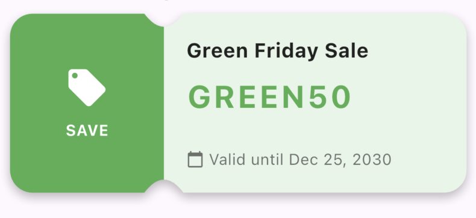
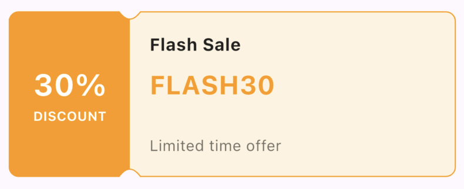

# Coupon UI Kit

[](https://pub.dev/packages/coupon_uikit)
[](https://pub.dev/packages/coupon_uikit)
[](https://pub.dev/packages/coupon_uikit)

A Flutter package that provides widgets and custom clippers to implement coupon card shapes with beautiful designs.

## Features

- **Flexible Design**: Create horizontal or vertical coupon cards
- **Customizable**: Control curve position, radius, border radius, and more
- **Multiple Styles**: Support for shadows, borders, gradients, and custom decorations
- **Custom Clippers**: Use `CouponClipper` to create your own custom coupon widgets
- **Well Documented**: Comprehensive documentation and examples

## Screenshots

<div align="center">

<table>
<tr>
<td align="center">
<div style="background-color: #f5f5f5; padding: 10px; border-radius: 8px; display: inline-block;">

</div>
<br/><strong>Basic Coupon Cards</strong>
</td>
<td align="center">
<div style="background-color: #f5f5f5; padding: 10px; border-radius: 8px; display: inline-block;">

</div>
<br/><strong>Basic Coupon Cards 2</strong>
</td>
<td align="center">
<div style="background-color: #f5f5f5; padding: 10px; border-radius: 8px; display: inline-block;">

</div>
<br/><strong>Rounded Coupon Cards</strong>
</td>
</tr>
<tr>
<td align="center">
<div style="background-color: #f5f5f5; padding: 10px; border-radius: 8px; display: inline-block;">

</div>
<br/><strong>Bordered Coupon Cards</strong>
</td>
<td align="center">
<div style="background-color: #f5f5f5; padding: 10px; border-radius: 8px; display: inline-block;">

</div>
<br/><strong>Vertical Coupon Cards</strong>
</td>
<td align="center">
<div style="background-color: #f5f5f5; padding: 10px; border-radius: 8px; display: inline-block;">

</div>
<br/><strong>Gradient Coupon Cards</strong>
</td>
</tr>
<tr>
<td align="center" colspan="3">
<div style="background-color: #f5f5f5; padding: 10px; border-radius: 8px; display: inline-block;">

</div>
<br/><strong>Custom Styled Coupons</strong>
</td>
</tr>
</table>

</div>

## Installation

Add this to your package's `pubspec.yaml` file:

```yaml
dependencies:
  coupon_uikit: ^latest
```

Then run:

```bash
flutter pub get
```

## Usage

There are two ways to get started:

### 1. Using the `CouponCard` Widget

The easiest way is to use the built-in `CouponCard` widget:

```dart
import 'package:coupon_uikit/coupon_uikit.dart';

CouponCard(
  height: 150,
  backgroundColor: Colors.blue,
  curveAxis: Axis.vertical,
  firstChild: Container(
    color: Colors.red,
    child: Center(child: Text('23% OFF')),
  ),
  secondChild: Container(
    padding: EdgeInsets.all(16),
    child: Column(
      children: [
        Text('Coupon Code'),
        Text('FREESALES', style: TextStyle(fontSize: 24)),
      ],
    ),
  ),
)
```

### 2. Using the `CouponClipper` Class

If you want more control, you can use the `CouponClipper` to create your own custom widget:

```dart
import 'package:coupon_uikit/coupon_uikit.dart';

ClipPath(
  clipper: CouponClipper(
    borderRadius: 8,
    curveRadius: 20,
    curvePosition: 100,
    curveAxis: Axis.horizontal,
  ),
  child: Container(
    width: 350,
    height: 400,
    color: Colors.purple,
    // Your custom content here
  ),
)
```

## Properties

### CouponCard

| Property          | Type          | Default           | Description                                  |
| ----------------- | ------------- | ----------------- | -------------------------------------------- |
| `firstChild`      | `Widget`      | **required**      | The first section of the coupon card         |
| `secondChild`     | `Widget`      | **required**      | The second section of the coupon card        |
| `width`           | `double?`     | `null`            | Width of the coupon card                     |
| `height`          | `double`      | `150`             | Height of the coupon card                    |
| `borderRadius`    | `double`      | `8`               | Border radius for corners                    |
| `curveRadius`     | `double`      | `20`              | Size of the cutout curve                     |
| `curvePosition`   | `double`      | `100`             | Position of the curve                        |
| `curveAxis`       | `Axis`        | `Axis.horizontal` | Direction of the curve (horizontal/vertical) |
| `clockwise`       | `bool`        | `false`           | Border radius direction                      |
| `backgroundColor` | `Color?`      | `null`            | Background color                             |
| `decoration`      | `Decoration?` | `null`            | Custom decoration (gradient, etc.)           |
| `shadow`          | `Shadow?`     | `null`            | Shadow effect                                |
| `border`          | `BorderSide?` | `null`            | Border around the coupon                     |

## Example

Check out the [example](https://github.com/devmuaz/coupon_uikit/tree/master/example) directory for a complete showcase of all available widgets and styles.

## Medium Articles

You can read articles about Flutter development on my [devmuaz](https://devmuaz.medium.com/) Medium account.

## Contributions & Support

Issues and pull requests are always welcome 😄

If you find this package useful and like it, please:
- Give it a like ❤️ on [pub.dev](https://pub.dev/packages/coupon_uikit)
- Star the repo ⭐️ on [GitHub](https://github.com/devmuaz/coupon_uikit)

## License

**MIT**
